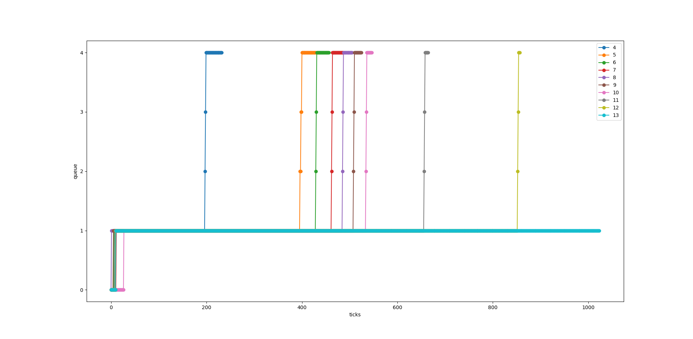

# Comparing different schedulers

After running  same set of different types (short job, jong job, io bound) of processes on different schedulers the following results were obtained:

|     | wtime(w) | rtime(r) | total time(w+r) |
|:----|:---------| :--------| :---------------|
| RR  |    584   |   973    |      1557       |
| FCFS|   1349   |   961    |      2310       |
| PBS |   586    |   973    |      1559       |
| MLFQ|   1166   |   961    |      2127       |

It can be seen that PBS did decent job than rest of the algorithms by giving less total runtime for same jobs but it is only because correct priorities were set for the jobs, i.e. IO extensive jobs were given higher priority than the rest of them. The priorities are usually not known before hand, hence it not always will give optimum results.

FCFS gave the maximum total time because due the convoy effect. If a large CPU bound process comes first then other processes wait which is not efficient.

MLFQ is a complex algorithm and thus spends a considerable amount of time in deciding things like aging and changing queue level of processes. Though the efficient time slot allotment to processes that too without explicitly defining priority is a perk, and the efficient allotment also lead to less run time(becuase of less preemption), the total time is still high becuase of high wait time due to decision making.

RR seems to have done a best job in this experiment. But it has problems like low time quanta will lead to more context switches leading to CPU time wastage and high time quanta will decrease the responsiveness of the system. The allotment of same time quanta to both io bound and cpu bound processes is also not fair.

Overall a best scheduling algorithm can only be pickes when the user requirements are known precisely.
For example FCFS is not suitable if we need a responsive system. PBS is not suitable when we incoming processes are known in terms of being CPU bound or I/O bound. MLFQ and RR can be suitable in maintaing a general responsiveness of the system. MLFQ n addition preempts CPU bound processes less often but is complex and need very efficient implementation to minimize resource wastage in decision making,

## Bonus: Graph

The graph has been plotted for the child processes of the official benchmark provided.  

